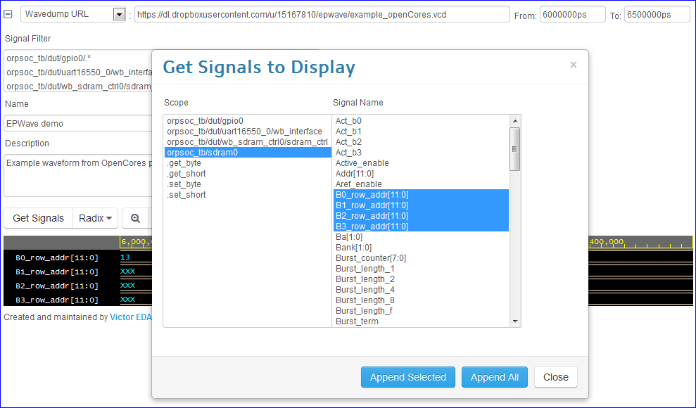

###########
Quick Start
###########

*************
Loading Waves
*************

* You must be logged in to load or save waves.
* Specify the wave dump file to load. There are 2 sources for loading waves.

  #. Specify the URL pointing to the waves accessible over the web, such as a file in a public Dropbox folder.
  #. Upload the wave dump from your own computer.
  
* After specifying the wave dump file, if your wave dump contains fewer than 2000 signals, you can click the **Load**
  button to load the waves.
  
* If your wave dump contains 2000 signals or larger, you must specify a *Signal Filter* so that fewer than 2000 signals are loaded.
  Click on the **+** on the top left to open the *Signal Filter*. For \*.vcd files, the filter accepts regular expressions.

  .. image:: _static/signal_filter.png
  
  After specifying the *Signal Filter*, click the **Load** button to load the waves.

* (Optional) You may specify the *From* and/or *To* times to limit the time range of the loaded wave.
  If your wave dump contains a lot of data, then the ending *To* time will automatically be limited.
  
  .. image:: _static/from_to.png

***************
Viewing Signals
***************

After loading the waves, you can display signals by using the **Get Signals** button.

